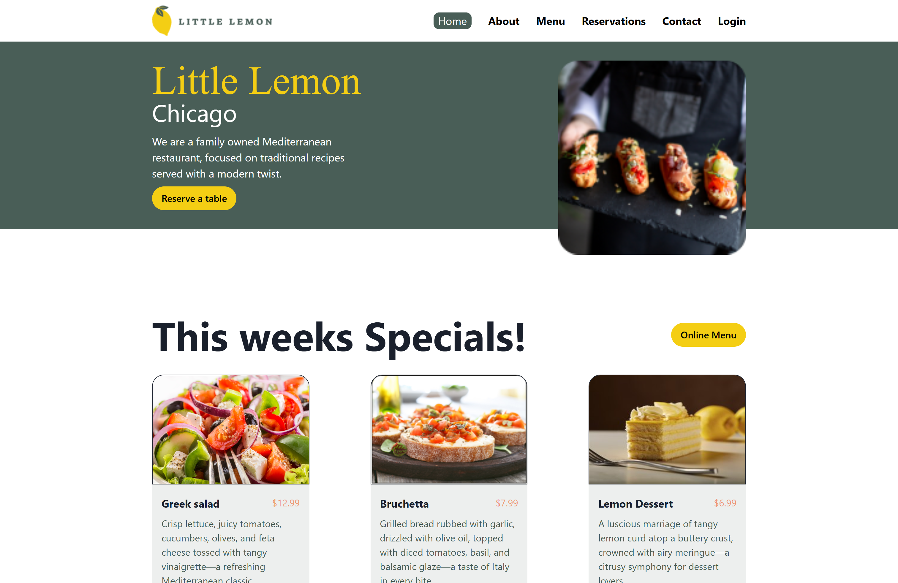
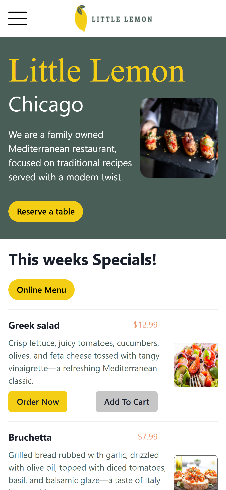
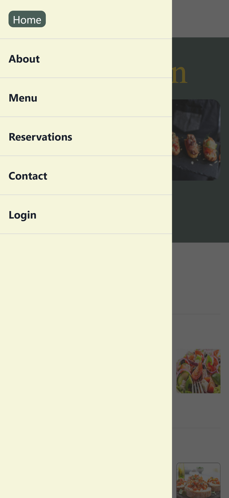

# Little Lemon Restaurant



A modern, responsive Mediterranean restaurant website built with React, Redux Toolkit, and Chakra UI. Features online food ordering, table reservation, and user authentication.

## Table of Contents

- [Project Overview](#project-overview)
- [Key Features](#key-features)
- [Technologies Used](#technologies-used)
- [Screenshots](#screenshots)
- [Installation & Setup](#installation--setup)
- [Project Structure](#project-structure)
- [License](#license)

## Project Overview

Little Lemon Restaurant is a comprehensive web application that provides customers with an interactive platform to browse menu items, place food orders online, make table reservations, and create user accounts. The application is built with modern web technologies and follows responsive design principles to ensure optimal viewing experience across all device sizes.

## Key Features

- **Online Menu Browsing**: Browse food items by categories with filtering options
- **Shopping Cart**: Add/remove items, adjust quantities, and view order summary
- **Table Reservation**: Book tables by selecting date, time, and party size
- **User Authentication**: Create accounts and log in securely
- **Responsive Design**: Optimized for all screen sizes from mobile to desktop

## Technologies Used

- **React 18**: Component-based UI development with the latest React features
- **Redux Toolkit**: State management for cart, authentication, and menu items
- **React Router**: Navigation and routing between different pages
- **Chakra UI**: Modern component library for consistent and accessible UI elements
- **SASS/SCSS**: Advanced styling with variables, mixins, and nested rules
- **Formik & Yup**: Form handling and validation for reservation and authentication forms

## Screenshots

### Landing Page


### Desktop View


### Mobile View

<div style="display: flex; justify-content: space-between;">
  
  
</div>

## Installation & Setup

1. Clone the repository:

   ```bash
   git clone https://github.com/yourusername/little_lemon_restaurant.git
   cd little_lemon_restaurant
   ```

2. Install dependencies:

   ```bash
   npm install
   ```

3. Start the development server:

   ```bash
   npm start
   ```

4. Build for production:
   ```bash
   npm run build
   ```

## Project Structure

```
src/
├── components/
│   ├── layout/     # Layout components (Header, Footer, Nav, Main)
│   ├── others/     # Reusable UI components
│   └── pages/      # Page components
├── store/          # Redux store configuration and slices
├── sass/           # SCSS files with variables, mixins, and page styles
│   ├── helpers/    # SCSS variables, mixins, and utility functions
│   └── pages/      # Page-specific styles
└── css/            # Compiled CSS files
```

## License

This project is licensed under the MIT License - see the LICENSE file for details.
